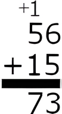
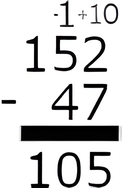
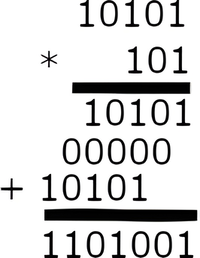
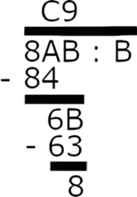
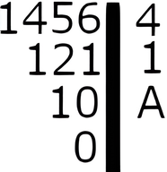

# Implementation

To overcome the limitations associated with the small range of data types like `int` and `long int`, numbers are represented as a sequence of ASCII characters. This representation allows numbers to be as lengthy as the computer's cache memory permits. Arithmetic operations are executed in a manner akin to manual columnar arithmetic.

## Addition

Digits from corresponding positions in two numbers are summed. If a carry-over occurs, it is added to the subsequent digit.

*Example in octal system:*

## Subtraction

This operation is similar to addition, but in cases where a digit is insufficient, the base value is added and the subsequent digit is decremented.

*Example in the decimal system:*

## Multiplication

Digits from the right side of one number are sequentially multiplied by the entire second number. If there's an overflow, the excess is carried over to the next digit. The final result is the sum of these multiplication products.

*Example in the binary system:*

## Division

A group of digits from the dividend is selected to ensure that the divisor fits into it at least once. The frequency of the divisor fitting into this segment is recorded, followed by a subtraction of the product of this frequency and the divisor from the segment. The next digit is then appended, and the process repeats.

*Example in the hexadecimal system:*

## Modulo

The remainder left over from the division process described earlier constitutes the modulo result.

## Exponentiation

The method involves successively multiplying the base number by powers of two, reducing the overall number of operations required.

*Example:*
<code>6245</code> is calculated as <code>6128 * 664 * 632 * 616 * 64 * 61</code>

## Numeral System Conversions

### To Decimal

Each digit is assigned a weight based on the numeral system's base raised to the power corresponding to the digit's position. The number is converted to decimal by multiplying each digit by its weight and summing the results.

*Example in the ternary system:*
`12012` translates to <code>1\*34 + 2\*33 + 0\*32 + 1\*31 + 2\*30 = 81 + 54 + 3 + 2 = 140</code>

### From Decimal

The decimal number is divided by the new base, and the remainder is recorded. The process continues until the quotient reaches zero. The converted number is then composed of the remainders, arranged from the least significant to most significant.

*Example in the duodecimal system:*

### Between Bases

Conversion between different numeral systems is a two-step process. First, convert the number from the original base to decimal, and then from decimal to the target base.